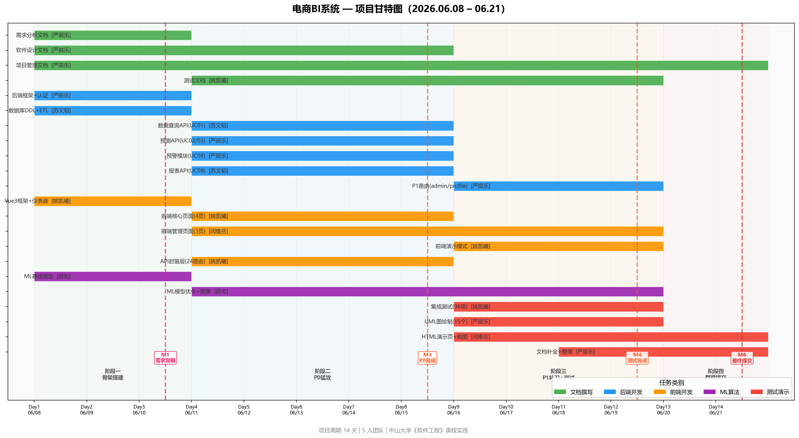

# 项目管理文档

> **项目**：基于AI智能的电商商品销售分析与预测系统
> **版本**：v2.0
> **日期**：2026-06-22
> **组长**：严辰乐（24325289）

---

## 1. 项目概述

| 项目 | 内容 |
|------|------|
| 选题 | 三(1) — 企业商业智能（BI）分析系统 |
| 目标 | 构建电商销售分析与预测平台，支持多维分析/趋势预测/库存优化/用户画像/异常预警 |
| 团队 | 5人 |
| 周期 | 约10-14天（第17-18周） |
| 交付物 | 4份文档 + 程序代码 + 测试数据 + 演示视频 + PPT |

---

## 2. 项目计划

### 2.1 甘特图



> **原始素材**：PlantUML 源文件见 `docs/uml/16-gantt.puml`（可用 https://plantuml.com 在线渲染）；Draw.io 源文件待补充。

### 2.2 里程碑

| 里程碑 | 时间 | 完成标准 |
|--------|------|----------|
| M1 需求分析定稿 | Day 3 | 需求文档 v1.0 组内评审通过 |
| M2 代码骨架就绪 | Day 3 | 后端可启动、前端可渲染、ML可输出 |
| M3 P0 功能完成 | Day 8 | 5个P0用例可端到端跑通 |
| M4 测试完成 | Day 12 | 功能测试通过，P0 Bug清零 |
| M5 演示就绪 | Day 12 | PPT + 视频录制完成 |
| M6 最终提交 | Day 14 | 全部制品检查通过并提交 |

---

## 3. 团队分工

### 3.1 角色分配

| 姓名 | 角色 | 核心职责 |
|------|------|----------|
| 严辰乐 | 组长 / 后端核心 / 项目管理 | 架构设计、认证授权、ML集成、预警调度、进度管控、文档质量把关、UML图 |
| 苏文韬 | 后端数据 / 数据库 | 数据库设计实现、ETL数据管道、查询/报表/导出API |
| 姚凯曦 | 前端开发 / 测试 / 文档 | 登录/预警/管理/数据源页面、演示模式、API封装层、测试文档、部署说明 |
| 薛淞 | ML算法 | 销售预测、库存预测、异常检测、用户画像、营销评估（8步管道） |
| 闫维岳 | 演示材料 / 联调测试 | HTML演示页、系统截图、UML图PNG导出、前后端API联调 |

### 3.2 各人工作量分布

```
严辰乐  ████████████████████████████  🔴 最重（后端核心 + 组长管理）
苏文韬  ██████████████████████        🟡 偏重（数据库 + 后端数据层）
闫维岳  ██████████████████████        🟡 偏重（前端核心5-6页）
薛淞    ██████████████████████        🟡 偏重（4个ML模型）
姚凯曦  ██████████████████            🟡 偏重（前端4-5页 + 测试）
```

### 3.3 详细分工表

详见 `docs/团队分工说明.md`

---

## 4. 进度跟踪

### 4.1 当前状态（2026-06-22，最终）

| 成员 | 交付成果 | 状态 |
|------|----------|------|
| 严辰乐 | 需求文档+设计文档+项目管理+16个UML+后端8模块23路由+认证/预测/预警/管理/画像路由+APScheduler+JWT中间件+2套集成测试(96项)+HTML演示页+文档审计 | ✅ 100% |
| 苏文韬 | 10表DDL(645行)+db_service(6函数)+data_routes+report_routes+随机数据脚本(1200条)+种子数据 | ✅ 100% |
| 姚凯曦 | 登录页+用户管理页+预警页+数据源页+演示模式+API封装层(23路由)+测试报告 | ✅ 100% |
| 薛淞 | ml_pipeline(8步:销售预测+库存补货+异常检测+用户画像+营销评估)+ml.md | ✅ 100% |
| 闫维岳 | HTML交互演示页+系统截图(7张)+UML图PNG导出+前后端联调 | ✅ 100% |

### 4.2 每日进度记录

| 日期 | 成员 | 完成内容 | 卡点 |
|------|------|----------|------|
| 6/8 | 严辰乐 | 需求文档定稿、后端框架+JWT、设计架构章、函数接口文档、GitHub仓库 | 无 |
| 6/9 | 苏文韬 | init.sql(10张表DDL+种子数据)交付、db_service.py(6函数) | 种子数据仅163条 |
| 6/10 | 薛淞 | ml_pipeline.py基线完成（训练+预测+异常+库存） | 数据未就位 |
| 6/10 | 姚凯曦 | Vue3框架搭建、仪表盘骨架、登录页 | 无 |
| 6/11 | 严辰乐 | 认证集成测试(36项)、JWT中间件、predict_routes对接ML | 无 |
| 6/12 | 苏文韬 | data_routes.py + report_routes.py完成、随机数据脚本(1200条) | 无 |
| 6/13 | 闫维岳 | 前端核心4页（查询/预测/报表/仪表盘）、与姚凯曦分工调整 | 无 |
| 6/14 | 姚凯曦 | API封装层(23路由对接)、演示模式实现 | 无 |
| 6/14 | 严辰乐 | 预警API(规则CRUD+扫描)、APScheduler定时调度 | 无 |
| 6/15 | 薛淞 | ML模型优化、用户画像(RFM)、函数签名对齐后端 | 无 |
| 6/16 | 严辰乐 | P1路由(admin+datasource+profile)全部完成 | 无 |
| 6/17 | 闫维岳 | HTML演示页初版、7张系统截图 | 无 |
| 6/18 | 姚凯曦 | 集成测试(60项)、前端bug修复 | 无 |
| 6/19 | 严辰乐 | 16个UML PlantUML源文件 + PNG导出、文档一致性审计(8项修复) | 无 |
| 6/20 | 全员 | 前端管理页收尾、ML模块4处修复、5份心得收齐 | 无 |
| 6/21 | 严辰乐 | 分工说明文档、甘特图、最终整理提交 | 无 |

---

## 5. 风险管理

### 5.1 风险清单

| 编号 | 风险 | 概率 | 影响 | 缓解措施 | 负责人 |
|------|------|------|------|----------|--------|
| R1 | 苏文韬数据库DDL延迟交付 | 中 | 高 | 严辰乐可先写死建表SQL作为兜底，后续替换 | 严辰乐 |
| R2 | 薛淞ML模型精度不达标(MAPE>20%) | 中 | 中 | 先用简单模型(线性回归)跑通流程，精度后续迭代 | 薛淞 |
| R3 | 闫维岳前端页面工作量超预期(10页) | 高 | 高 | 姚凯曦分担4-5页管理类页面；P1/P2页面仅占位 | 闫维岳+姚凯曦 |
| R4 | Kaggle数据字段与需求不匹配 | 中 | 中 | 苏文韬用Python脚本补充缺失字段；严辰乐写兜底模拟数据脚本 | 苏文韬 |
| R5 | 组员投入时间不足 | 中 | 高 | 组长每日检查进度，P0铁律第8天砍P1/P2 | 严辰乐 |
| R6 | 前后端接口理解不一致 | 低 | 中 | 第2天锁死API文档(函数参数需求文档)，后续以此为准 | 严辰乐 |
| R7 | 演示时系统崩溃 | 低 | 高 | 提前录制视频兜底；演示前完整走一遍流程 | 全员 |

### 5.2 P0 铁律

**第8天检查**：如果 P0（UC-01/02/03/08/09）未全部跑通：
1. 全员停下手头工作
2. P1/P2 全部砍掉
3. 集中人力攻坚 P0
4. 演示只展示 P0 功能

---

## 6. 版本控制

### 6.1 仓库信息

| 项目 | 内容 |
|------|------|
| 平台 | GitHub |
| 仓库地址 | https://github.com/Qian-YiChen/ecommerce-bi-system |
| 默认分支 | main |
| 协作方式 | 组长有写权限，组员通过 Collaborators 添加 |

### 6.2 分支策略

```
main ──── ● ──────────── ● ─────────── ●
           │               │
dev ────── ● ─── ● ─── ● ─── ● ─── ● ───
           │     │     │
feature/  suwentao  xue    yanyue
```

- `main`：稳定版本，仅从 `dev` 合并，不直接提交
- `dev`：开发集成分支，每日合并各 feature 分支
- `feature/<name>`：个人开发分支

### 6.3 提交规范

```
类型：简短描述

示例：
  新增：用户登录API POST /api/auth/login
  修复：JWT过期判断逻辑
  文档：更新需求分析文档Ch.4非功能需求
```

类型：`新增` `修复` `文档` `重构` `测试` `部署`

### 6.4 日常操作

```bash
git pull                    # 拉取最新代码
git add .                   # 暂存改动
git commit -m "类型：描述"   # 提交
git push                    # 推送到GitHub
```

---

## 7. 交付清单

| 编号 | 交付物 | 格式 | 负责人 | 状态 |
|------|--------|------|--------|------|
| 1 | 需求分析文档 | Markdown/PDF | 严辰乐 | ✅ v1.0（UML图已补全） |
| 2 | 软件设计文档 | Markdown/PDF | 严辰乐（架构/接口）+ 苏文韬（DB）+ 薛淞（ML）+ 闫维岳（UI） | ✅ UML图已补全 |
| 3 | 测试计划与用例报告 | Markdown/PDF | 姚凯曦 | ✅ 96/96通过 |
| 4 | 项目管理文档 | Markdown/PDF | 严辰乐 | ✅ v2.0 |
| 5 | 程序源代码 | 打包.zip | 全员 | ✅ 23路由+8页面+8步ML |
| 6 | 测试数据 | CSV/SQL | 姚凯曦+苏文韬 | ✅ 1200条+种子数据 |
| 7 | 系统演示材料 | HTML | 严辰乐+闫维岳 | ✅ HTML交互版（替代视频+PPT） |
| 8 | 部署说明 | Markdown | 姚凯曦 | ✅ |
| 9 | 组长提交：分工情况说明 | Markdown | 严辰乐 | ✅ docs/分工与工作情况说明.md |
| 10 | 组长提交：400字心得汇总 | Markdown | 严辰乐（收齐） | ✅ 5份已收齐 |
| 11 | 甘特图正式版 | PNG + PlantUML源文件 | 严辰乐 | ✅ `demo/演示用图/甘特图.png` + `docs/uml/16-gantt.puml` |

---

## 8. 会议记录

| 日期 | 形式 | 议题 | 结论 |
|------|------|------|------|
| 6/8 | 线上 | 需求文档评审、分工确认、GitHub仓库创建 | 需求文档v1.0通过，分工按2周冲刺方案执行。P2（推荐算法、竞品分析）风险高则砍。 |
| 6/12 | 线上 | P0进度检查、风险再评估 | 数据库DDL+数据管道就绪，ML基线可跑通全流程。P1优先级调整：admin/datasource/profile排到P0之后。 |
| 6/16 | 线上 | P0完成确认、演示方案讨论、分工收尾 | 5个P0用例全部端到端跑通。演示方案：HTML交互版替代PPT。剩余任务：UML图补全、测试收尾、心得撰写。 |
| 6/20 | 线上 | 交付物完整性检查、提交准备 | 13/15交付物完成。剩余：甘特图正式版、15分钟汇报视频。各组员心得已收齐，文档一致性审计通过。 |
| 6/22 | 线上 | 最终收尾：甘特图导出、文档一致性复查 | 甘特图正式版PNG已生成（22任务+4里程碑+4阶段），PlantUML源文件归档至docs/uml/。文档一致性复查通过。剩余唯一待办：15分钟汇报视频。 |

---

> **文档状态**：✅ v2.0 完成。甘特图、进度记录、会议记录已全部补充。
